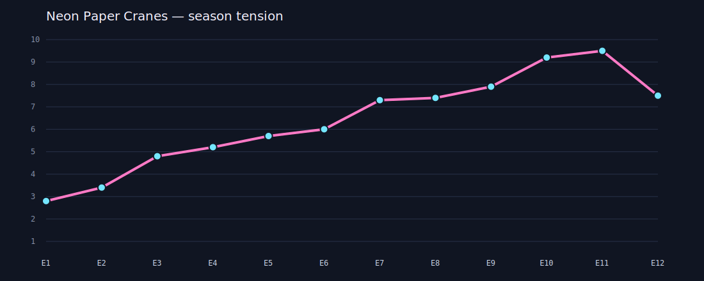

# Anime Arc Architect

A deterministic story-engineering tool for original anime concepts. It turns a
JSON cast-and-world specification into a complete season outline while tracking
more than episode titles: character focus balance, three-act tension, evolving
relationships, opened plot threads, and their eventual payoff.

This project deliberately uses an original setting and cast. It does not copy
characters, plots, dialogue, or visual assets from existing anime.



## What makes it more than a random prompt generator

- Validates character, relation, and season constraints before generation.
- Uses weighted focus scheduling so supporting characters receive meaningful episodes.
- Models a three-act tension curve with deterministic variation.
- Evolves relationship intensity from `-5` to `+5` across the season.
- Opens continuity threads during setup and escalation, then guarantees finale closure.
- Connects every episode beat to a character goal, fear, trait, faction, and theme.
- Exports JSON for tools, Markdown for writers, and SVG for visual inspection.

## Generate the included 12-episode example

Python 3.10 or newer is sufficient; there are no third-party dependencies.

```bash
python anime_arc_architect.py sample_season.json --output-dir examples
```

Generated artifacts:

- `examples/season_plan.json` — structured plan for further tooling.
- `examples/season_plan.md` — cast, season table, episode cards, and continuity audit.
- `examples/tension_curve.svg` — visual pacing curve across all episodes.

## Run tests

```bash
python -m unittest discover -s tests -v
```

The sample project and generated output were created with AI assistance as part
of a transparent creative-coding practice. The deterministic seed and tests make
the output reproducible and reviewable.
